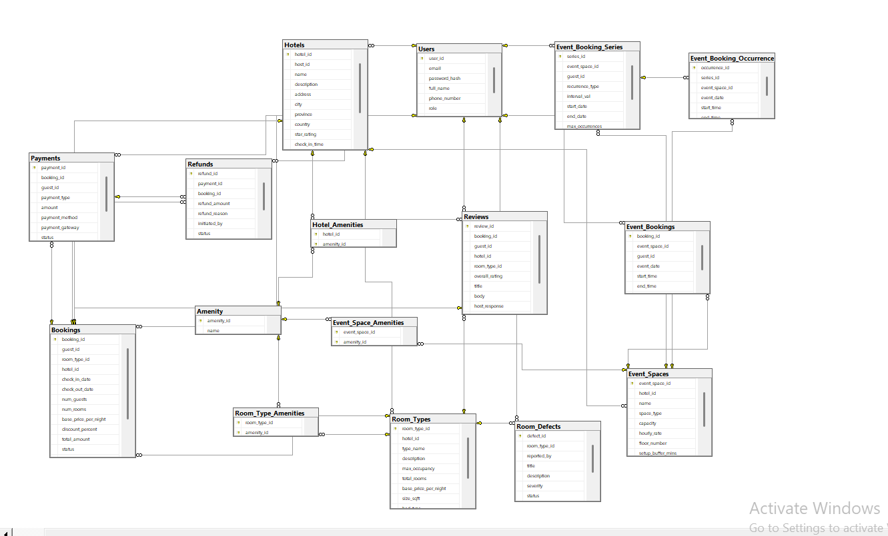

# 🏨 Smart Hotel Booking & Reservation Management System

<div align="center">


A full-stack hotel booking platform with role-based access for **Guests**, **Hosts**, and **Admins**, built on a layered architecture with a React frontend, Node.js/Express API, and a Microsoft SQL Server backend powered by stored procedures and triggers.

</div>

---

## 🛠 Tech Stack

| Layer | Technology |
|---|---|
| Frontend | React, Axios |
| Backend | Node.js, Express.js |
| Database | Microsoft SQL Server |
| Database Logic | T-SQL — Stored Procedures, Triggers, Views |
| Auth | JWT (JSON Web Tokens) |

---

## 🏗 Architecture

```
React (Frontend)  →  Node.js / Express (API)  →  SQL Server (Data Layer)
```

Business logic is enforced at the database level through stored procedures, triggers, and views — keeping the API layer lean and the data layer reliable.

---

## 📁 Project Structure

```
Booking-Management-System/     (branch: dev)
├── backend/                   # Express API + T-SQL scripts
├── frontend/                  # React SPA
└── .gitignore
```

---

## ✨ Core Modules

| Module | Key Highlights |
|---|---|
| **User & Auth** | Registration, login, profile management, role-based access control |
| **Hotels & Rooms** | Hotel listings, room type management, availability tracking |
| **Bookings** | Multi-room reservations, status lifecycle, auto-discount at high occupancy |
| **Payments** | Multi-method payments, automated refunds on cancellation, audit trail |
| **Defect Reporting** | Severity-based defect logging, auto room disable/enable via triggers |
| **Event Spaces** | Buffer-aware booking with conflict detection |
| **Reviews** | Post-stay reviews, admin moderation, host replies, rating breakdowns |
| **Dashboards** | Analytics views for hosts (occupancy, revenue) and admins (platform-wide insights) |

---

## 📡 API Documentation

Base URL: `http://localhost:5000/api/v1`

| Method | Endpoint | Access |
|---|---|---|
| POST | `/auth/register` | Public |
| POST | `/auth/login` | Public |
| GET | `/auth/profile` | All roles |
| PUT | `/auth/profile` | All roles |
| GET | `/hotels` | Guest |
| POST | `/hotels` | Host |
| PUT | `/hotels/:id` | Host |
| GET | `/hotels/:id/rooms` | Guest |
| POST | `/hotels/:id/rooms` | Host |
| POST | `/bookings` | Guest |
| GET | `/bookings/:id` | Guest / Host / Admin |
| PUT | `/bookings/:id/confirm` | Admin / Host |
| PUT | `/bookings/:id/cancel` | Guest / Admin |
| GET | `/bookings/history` | Guest / Host |
| POST | `/payments` | System |
| GET | `/payments/:bookingId/status` | Guest |
| GET | `/payments/history` | Guest / Host / Admin |
| GET | `/payments/:bookingId/audit` | Admin |
| POST | `/defects` | Guest / Host |
| PUT | `/defects/:id/status` | Host / Admin |
| POST | `/event-spaces` | Host |
| POST | `/event-spaces/:id/book` | Guest |
| POST | `/reviews` | Guest |
| PUT | `/reviews/:id` | Guest |
| DELETE | `/reviews/:id` | Admin |
| POST | `/reviews/:id/reply` | Host |

---

## 🗄 Database Schema



---

## 🚀 Getting Started

### Prerequisites
- Node.js v18+
- Microsoft SQL Server 2019+

### Setup

```bash
# 1. Clone and switch to dev branch
git clone https://github.com/rida288/Booking-Management-System.git
cd Booking-Management-System
git checkout dev

# 2. Run SQL scripts in SSMS or sqlcmd (schema → procedures → triggers → views → seed)

# 3. Backend
cd backend
cp .env.example .env        # add DB credentials and JWT secret
npm install && npm run dev  # runs on http://localhost:5000

# 4. Frontend
cd ../frontend
npm install && npm run dev  # runs on http://localhost:5173
```

### Environment Variables

```env
DB_SERVER=
DB_NAME=
DB_PASSWORD=
JWT_SECRET=
PORT=
```

---

## 📄 License

Academic project — Database Systems course. All rights reserved by the authors.
